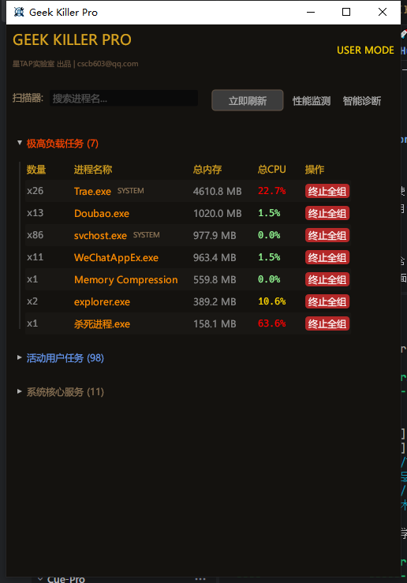

# 极客进程终止器 | Geek Killer

[](https://github.com/)
[](LICENSE)
[](https://www.rust-lang.org/)

### **[中文]**

**电脑卡到鼠标都动不了？顽固软件关不掉？这个工具就是你的“急救按钮”。**



**极客进程终止器 (Geek Killer)** 是一款专为 Windows 极端环境设计的 Rust 原生工具。它不像系统自带的任务管理器那样臃肿，而是追求在资源耗尽时的极致响应速度。

#### **🌟 为什么选择它？**
- **✅ 丝滑响应**：基于 Rust + `egui` 原生驱动，即使在 CPU/内存 100% 占用的情况下，界面依然不掉帧、不白屏。
- **✅ 智能“捉鬼”**：自动把最吃资源的“罪魁祸首”标红置顶，省去在几百个进程里翻找的痛苦。
- **✅ 连根拔起**：支持“终止全组”，一键干掉全家桶关联进程，杜绝死灰复燃。
- **✅ 极简绿色**：单文件 exe，无安装程序，不占注册表，随用随走。

#### **🚀 快速开始**
1. 下载 `Geek_Killer_v1.0.0.zip`。
2. 解压并运行 `杀死进程.exe`。
3. **极客建议**：右键“以管理员身份运行”可解锁最高杀敌权限。

---

### **[English]**

**System freezing? Stubborn apps won't close? This is your "Emergency Reset" button.**

**Geek Killer** is a high-performance process terminator built with Rust. Unlike the heavy Windows Task Manager, it focuses on extreme responsiveness when your system is struggling for breath.

#### **🌟 Key Features**
- **✅ Zero Lag Interface**: Powered by Rust + `egui` native rendering. Remains fluid even under 100% system load.
- **✅ Smart Culprit Pinning**: Automatically identifies and highlights resource hogs at the top of the list.
- **✅ Process Tree Wipe**: Terminate entire groups of associated processes with one click.
- **✅ Portable & Clean**: Single-file executable. No installation, no registry clutter, no bloat.

#### **🚀 Quick Start**
1. Download `Geek_Killer_v1.0.0.zip`.
2. Run `Geek_Killer.exe` (杀死进程.exe).
3. **Pro Tip**: Run as Administrator to handle high-privilege stubborn tasks.

---

## �️ 技术规格 (Technical Specs)

- **Engine**: Rust (Stable) + egui/eframe
- **Backend**: sysinfo + Win32 API
- **Optimization**: Zero-allocation buffer & Incremental Refresh
- **Design**: Coffee-Black & Retro-Gold (Geek Aesthetic)

## 🔨 编译 (Build)

```bash
cargo build --release
```

## 📜 协议 (License)

[MIT License](LICENSE)
