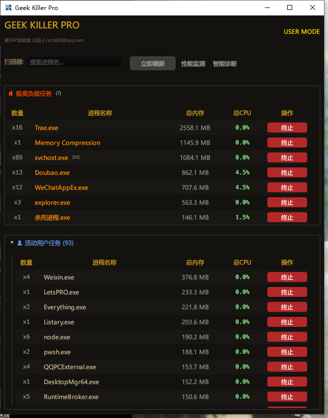

# 🚀 星TAP 卡顿克星 (Win) | LagKiller

> **"电脑卡死时的救命稻草，U 盘拔不掉时的强力外援。"**

## 🤔 为什么你需要它？(与 Windows 任务管理器对比)

你是否遇到过这些让人崩溃的瞬间？
1.  **电脑卡死**：CPU 飙到 100%，鼠标都动不了，**自带的任务管理器根本打不开**，或者打开了也是一片白板。
2.  **U 盘拔不掉**：点击弹出提示“设备正在使用中”，但**根本不知道是哪个软件在用**，最后只能冒险硬拔。
3.  **进程看不懂**：满屏的 `svchost.exe`, `SearchIndexer.exe`，**不知道哪个能杀，哪个杀了会蓝屏**。

**星TAP 卡顿克星** 就是为了解决这些痛点而生的。

---

## ✨ 小白看这里 (核心功能)

### 1. ⚡ 卡顿急救 (Panic Mode)
当你的电脑卡得连鼠标都动不了时，它是你唯一的希望。
-   **比自带的更强**：自带的任务管理器在卡死时往往也会跟着卡死。我们采用了特殊的 **"极简模式"**，当检测到系统卡顿时，自动降低自身消耗，优先保证能杀掉卡死的程序。
-   **一键复活**：自动列出占用 CPU/内存 最高的罪魁祸首，点击“终止”，电脑瞬间恢复流畅。

### 2. 💾 U 盘/硬盘强力弹出
别再冒着丢失数据的风险硬拔 U 盘了！
-   **秒拔模式**：点击弹出瞬间响应，不转圈，不等待。
-   **智能破案**：如果拔不掉，它会直接告诉你：“是 **Word** 还在占用”或者“是 **微信** 在读取文件”。
-   **暴力清场**：遇到流氓软件死赖着不走？点击【强力清场】，直接把占用进程“杀”掉，并强制把 U 盘“踢”出系统，确保安全拔出。

### 3. 🔍 进程名“说人话”
别再对着英文进程名发呆了。
-   **自动翻译**：
    -   `msedge.exe` -> **Edge 浏览器**
    -   `WeChat.exe` -> **微信**
    -   `svchost.exe` -> **系统服务宿主** (这个别乱杀！)
-   **分类清晰**：谁是**极高负载**，谁是**系统服务**，一目了然。

---

## 🛠️ 极客看这里 (技术内幕)

-   **内核**：基于 **Rust** 编写，内存安全，零运行时开销。
-   **GUI 架构**：使用 `egui` 即时模式 GUI，配合 **非阻塞 (Non-blocking)** 数据获取架构，确保 UI 线程永远保持 60FPS 响应，绝不卡死。
-   **Smart Eject 策略**：
    1.  `CM_Request_Device_EjectW` (PnP 弹出)
    2.  `RestartManager` (会话扫描)
    3.  `FSCTL_DISMOUNT_VOLUME` (卷卸载 - 核心大招)
    4.  `Kill Process` (进程终止)

---

## 📦 下载与使用

1.  **下载**：点击右侧 Releases 下载最新版的 `星TAP-卡顿克星-Win-v2.0.zip`。
2.  **使用**：解压后直接运行 exe。
    -   *建议右键选择“以管理员身份运行”，否则无法查杀系统级卡顿进程。*
3.  **便携**：纯绿色软件，无后台，无残留，用完即走。

---

## 📜 开源协议
MIT License | 星TAP 实验室出品
